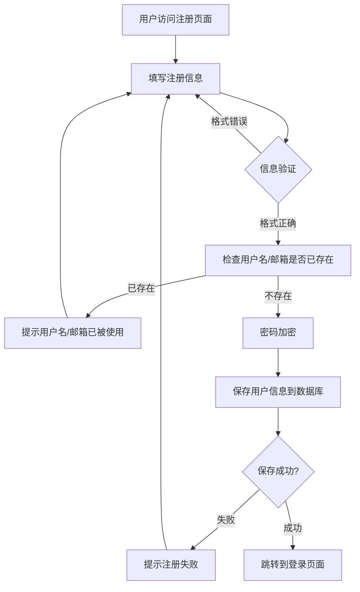
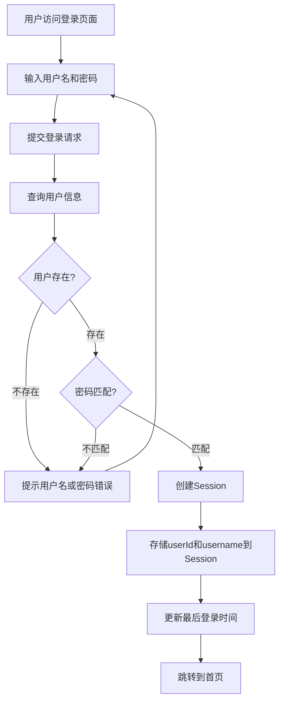
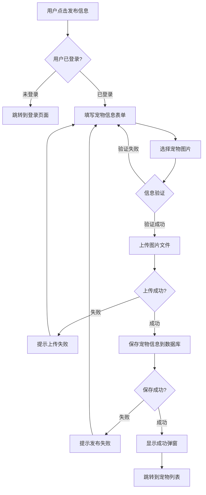
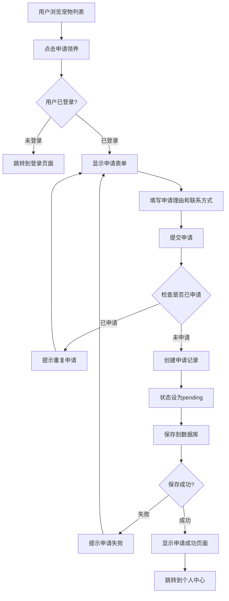
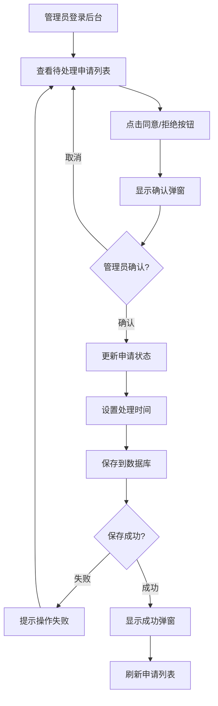
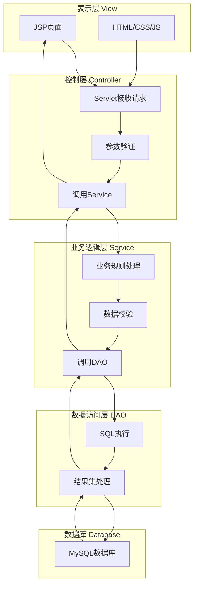

# 3 系统详细设计

## 3.1 详细设计说明

### 3.1.1 系统架构设计

本系统采用经典的**MVC三层架构模式**，结合**DAO设计模式**，实现业务逻辑与数据访问的分离。

#### 架构层次说明

**1. 表示层（View Layer）**
- **技术栈**：JSP + Bootstrap 5 + JavaScript
- **职责**：负责用户界面的展示和用户交互
- **主要页面**：
  - 用户端：首页、宠物列表、宠物详情、领养申请、个人中心、寻宠信息发布
  - 管理员端：仪表盘、宠物管理、用户管理、领养申请管理

**2. 控制层（Controller Layer）**
- **技术栈**：Jakarta Servlet API（基于注解的@WebServlet）
- **职责**：接收用户请求，调用业务逻辑层，返回响应
- **核心Servlet**：
  - 用户相关：`UserLoginServlet`、`UserRegisterServlet`、`UserLogoutServlet`
  - 宠物相关：`PetListServlet`、`PetDetailServlet`、`PetAddServlet`
  - 领养申请：`AdoptionServlet`、`AdoptionDeleteServlet`
  - 寻宠信息：`PetSearchServlet`、`SearchDeleteServlet`
  - 管理员：`AdminLoginServlet`、`AdminDashboardServlet`、`AdminPetListServlet`等

**3. 业务逻辑层（Service Layer）**
- **技术栈**：Java接口 + 实现类
- **职责**：封装业务逻辑，处理复杂的业务规则
- **核心Service**：
  - `PetService`：宠物信息管理业务
  - `AdoptionService`：领养申请业务
  - `PetSearchService`：寻宠信息业务
  - `AdoptionApplicationService`：申请记录查询业务

**4. 数据访问层（DAO Layer）**
- **技术栈**：JDBC + PreparedStatement
- **职责**：封装数据库操作，提供数据访问接口
- **核心DAO**：
  - `PetDao`：宠物数据访问
  - `AdoptionDao`：领养申请数据访问
  - `PetSearchDao`：寻宠信息数据访问
  - `AdoptionApplicationDao`：申请记录数据访问

**5. 实体层（Entity Layer）**
- **技术栈**：Java Bean（POJO）
- **职责**：封装业务实体对象
- **核心实体**：
  - `Pet`：宠物信息实体
  - `User`：用户信息实体
  - `Admin`：管理员信息实体
  - `AdoptionApplication`：领养申请实体
  - `PetSearch`：寻宠信息实体

**6. 工具层（Utils Layer）**
- **技术栈**：工具类
- **职责**：提供通用工具方法
- **核心工具**：
  - `JdbcUtils`：数据库连接管理
  - `FileUploadUtils`：文件上传处理

### 3.1.2 核心功能模块设计

#### 模块1：用户管理模块
- **用户注册**：邮箱、手机号唯一性校验，密码加密存储
- **用户登录**：Session管理，登录状态保持
- **个人中心**：查看发布的宠物、领养申请记录、寻宠信息

#### 模块2：宠物管理模块
- **宠物发布**：支持图片上传，信息录入
- **宠物列表**：支持按类型、性别、年龄范围筛选
- **宠物详情**：展示完整宠物信息
- **宠物编辑/删除**：用户可管理自己发布的宠物

#### 模块3：领养申请模块
- **申请提交**：填写申请理由和联系方式
- **重复申请检测**：防止同一用户重复申请同一宠物
- **申请状态管理**：pending（待处理）、approved（已同意）、rejected（已拒绝）
- **申请记录查询**：用户可查看自己的申请记录及状态

#### 模块4：寻宠信息模块
- **信息发布**：发布走失宠物信息，支持图片上传
- **状态管理**：searching（寻找中）、found（已找回）
- **信息查询**：查看所有寻宠信息

#### 模块5：管理员模块
- **登录认证**：管理员身份验证
- **仪表盘**：统计待领养宠物、已领养数量、注册用户、待处理申请
- **宠物管理**：增删改查宠物信息
- **用户管理**：查看所有注册用户
- **申请审核**：同意/拒绝领养申请

### 3.1.3 关键技术实现

**1. 数据库连接管理**
- 使用`JdbcUtils`工具类统一管理数据库连接
- 采用静态代码块加载配置文件（`db.properties`）
- 提供连接获取和资源关闭方法，避免连接泄漏

**2. 文件上传处理**
- 使用`FileUploadUtils`处理图片上传
- 支持JPG、PNG、GIF格式，最大5MB
- 文件存储路径：`/uploads/`目录

**3. Session管理**
- 用户登录后，将`userId`和`username`存入Session
- 管理员登录后，将`adminId`存入Session
- 使用`LoginFilter`过滤器进行权限控制

**4. 统一异常处理**
- 数据库操作异常统一捕获并记录
- 用户友好的错误提示信息

**5. UI统一设计**
- 采用"薄巧配色"（薄荷绿、粉红、淡蓝）的渐变风格
- 统一的弹窗提示样式（p3格式）
- 响应式布局，适配不同屏幕尺寸

---

## 3.2 数据库设计

### 3.2.1 数据库概述

- **数据库名称**：`pet_adopt`
- **字符集**：utf8mb4
- **排序规则**：utf8mb4_unicode_ci
- **存储引擎**：InnoDB

### 3.2.2 数据表设计

#### 表1：pet（宠物信息表）

| 字段名 | 类型 | 约束 | 说明 |
|--------|------|------|------|
| id | INT(11) | PRIMARY KEY, AUTO_INCREMENT | 宠物ID，主键 |
| name | VARCHAR(50) | NOT NULL | 宠物名称 |
| type | VARCHAR(20) | NOT NULL | 宠物类型（猫、狗等） |
| age | INT(11) | NOT NULL | 宠物年龄（单位：岁） |
| gender | VARCHAR(10) | NOT NULL | 宠物性别（公/母） |
| description | TEXT | NULL | 宠物描述信息 |
| image_path | VARCHAR(255) | NULL | 宠物图片路径 |
| user_id | INT(11) | NULL | 发布用户ID |
| create_time | DATETIME | DEFAULT CURRENT_TIMESTAMP | 创建时间 |

**索引设计**：
- PRIMARY KEY (`id`)
- INDEX `idx_user_id` (`user_id`)

#### 表2：user（用户表）

| 字段名 | 类型 | 约束 | 说明 |
|--------|------|------|------|
| id | INT(11) | PRIMARY KEY, AUTO_INCREMENT | 用户ID，主键 |
| username | VARCHAR(50) | NOT NULL, UNIQUE | 用户名 |
| email | VARCHAR(100) | NOT NULL, UNIQUE | 邮箱 |
| phone | VARCHAR(20) | NOT NULL | 手机号 |
| password | VARCHAR(255) | NOT NULL | 密码（加密存储） |
| create_time | DATETIME | DEFAULT CURRENT_TIMESTAMP | 注册时间 |
| last_login_time | DATETIME | NULL | 最后登录时间 |

**索引设计**：
- PRIMARY KEY (`id`)
- INDEX `idx_username` (`username`)
- INDEX `idx_email` (`email`)

#### 表3：admin（管理员表）

| 字段名 | 类型 | 约束 | 说明 |
|--------|------|------|------|
| id | INT(11) | PRIMARY KEY, AUTO_INCREMENT | 管理员ID，主键 |
| username | VARCHAR(50) | NOT NULL, UNIQUE | 管理员账号 |
| password | VARCHAR(255) | NOT NULL | 密码（加密存储） |
| name | VARCHAR(50) | NULL | 管理员姓名 |
| role | VARCHAR(20) | DEFAULT 'admin' | 角色（admin/super_admin） |
| create_time | DATETIME | DEFAULT CURRENT_TIMESTAMP | 创建时间 |
| last_login_time | DATETIME | NULL | 最后登录时间 |

**索引设计**：
- PRIMARY KEY (`id`)
- INDEX `idx_username` (`username`)

#### 表4：adoption_application（领养申请表）

| 字段名 | 类型 | 约束 | 说明 |
|--------|------|------|------|
| id | INT(11) | PRIMARY KEY, AUTO_INCREMENT | 申请ID，主键 |
| pet_id | INT(11) | NOT NULL | 宠物ID |
| user_id | INT(11) | NOT NULL | 申请人ID |
| reason | TEXT | NULL | 申请理由 |
| contact | VARCHAR(100) | NOT NULL | 联系方式 |
| status | VARCHAR(20) | DEFAULT 'pending' | 状态（pending/approved/rejected） |
| create_time | DATETIME | DEFAULT CURRENT_TIMESTAMP | 申请时间 |
| process_time | DATETIME | NULL | 处理时间 |

**索引设计**：
- PRIMARY KEY (`id`)
- INDEX `idx_pet_id` (`pet_id`)
- INDEX `idx_user_id` (`user_id`)
- INDEX `idx_status` (`status`)

**外键关系**：
- `pet_id` 关联 `pet.id`
- `user_id` 关联 `user.id`

#### 表5：pet_search（寻宠信息表）

| 字段名 | 类型 | 约束 | 说明 |
|--------|------|------|------|
| id | INT(11) | PRIMARY KEY, AUTO_INCREMENT | 寻宠信息ID，主键 |
| name | VARCHAR(50) | NOT NULL | 宠物名称 |
| type | VARCHAR(20) | NOT NULL | 宠物类型 |
| age | INT(11) | NULL | 宠物年龄 |
| gender | VARCHAR(10) | NULL | 宠物性别（公/母） |
| location | VARCHAR(200) | NOT NULL | 丢失地点 |
| lost_time | DATETIME | NOT NULL | 丢失时间 |
| description | TEXT | NULL | 宠物特征描述 |
| image_path | VARCHAR(255) | NULL | 宠物照片路径 |
| contact | VARCHAR(100) | NOT NULL | 联系方式 |
| user_id | INT(11) | NULL | 发布用户ID |
| status | VARCHAR(20) | DEFAULT 'searching' | 状态（searching/found） |
| create_time | DATETIME | DEFAULT CURRENT_TIMESTAMP | 发布时间 |

**索引设计**：
- PRIMARY KEY (`id`)
- INDEX `idx_user_id` (`user_id`)
- INDEX `idx_status` (`status`)

### 3.2.3 数据库关系图（ER图）

```
┌─────────────┐         ┌──────────────────────┐         ┌─────────────┐
│    User     │         │ AdoptionApplication  │         │    Pet      │
├─────────────┤         ├──────────────────────┤         ├─────────────┤
│ id (PK)     │◄──┐     │ id (PK)              │     ┌──►│ id (PK)     │
│ username    │   │     │ pet_id (FK)          │─────┘   │ name        │
│ email       │   │     │ user_id (FK)         │         │ type        │
│ phone       │   │     │ reason               │         │ age         │
│ password    │   │     │ contact              │         │ gender      │
│ create_time │   │     │ status               │         │ description │
└─────────────┘   │     │ create_time          │         │ image_path  │
                  │     │ process_time         │         │ user_id     │
                  └─────┤                      │         │ create_time │
                        └──────────────────────┘         └─────────────┘
                                                                   │
                        ┌──────────────────────┐                   │
                        │    PetSearch         │                   │
                        ├──────────────────────┤                   │
                        │ id (PK)              │                   │
                        │ name                 │                   │
                        │ type                 │                   │
                        │ location             │                   │
                        │ lost_time            │                   │
                        │ description          │                   │
                        │ contact              │                   │
                        │ user_id (FK)         │───────────────────┘
                        │ status               │
                        │ create_time          │
                        └──────────────────────┘

┌─────────────┐
│    Admin    │
├─────────────┤
│ id (PK)     │
│ username    │
│ password    │
│ name        │
│ role        │
│ create_time │
└─────────────┘
```

---

## 3.3 系统流程框图

### 3.3.1 用户注册流程



### 3.3.2 用户登录流程



### 3.3.3 宠物发布流程



### 3.3.4 领养申请流程



### 3.3.5 管理员审核流程



### 3.3.6 系统整体架构流程



---

## 3.4 性能设计

### 3.4.1 数据库性能优化

**1. 索引优化**
- 在`user`表的`username`和`email`字段建立唯一索引，提高查询速度
- 在`adoption_application`表的`pet_id`、`user_id`、`status`字段建立索引，优化关联查询
- 在`pet_search`表的`user_id`和`status`字段建立索引，加快筛选查询

**2. 查询优化**
- 使用`PreparedStatement`预编译SQL，提高执行效率
- 避免使用`SELECT *`，只查询需要的字段
- 使用分页查询（未来扩展），避免一次性加载大量数据

**3. 连接池管理**
- 使用`JdbcUtils`统一管理数据库连接
- 及时关闭连接，避免连接泄漏
- 未来可升级为连接池（如HikariCP、Druid）

### 3.4.2 前端性能优化

**1. 资源优化**
- 使用CDN加载Bootstrap和图标库，减少服务器压力
- 图片懒加载（`loading="lazy"`）
- 图片压缩和格式优化（JPG/PNG）

**2. 交互优化**
- 使用AJAX异步提交，避免页面刷新
- 统一弹窗提示，提升用户体验
- 表单验证在前端完成，减少服务器请求

**3. 缓存策略**
- 静态资源（CSS、JS、图片）设置浏览器缓存
- Session管理，减少重复登录

### 3.4.3 系统扩展性设计

**1. 水平扩展**
- 无状态设计，Session存储在服务器内存（未来可改为Redis）
- 文件上传独立存储（未来可改为OSS对象存储）

**2. 垂直扩展**
- 数据库读写分离（未来扩展）
- 缓存层（Redis）减轻数据库压力（未来扩展）

**3. 代码可维护性**
- 分层架构，职责清晰
- 接口与实现分离，便于扩展
- 统一异常处理和日志记录

---

## 3.5 界面设计

### 3.5.1 设计理念

本系统采用**"薄巧配色"**（Light and Elegant Color Scheme）设计理念，以薄荷绿、粉红、淡蓝为主色调，营造温馨、友好的视觉体验。

**配色方案**：
- **主色调**：`#a8e6cf`（薄荷绿）
- **辅助色**：`#ffd3d3`（粉红）、`#c7ecee`（淡蓝）
- **背景渐变**：`linear-gradient(135deg, #e8f5e9 0%, #f1f8e9 50%, #fff9c4 100%)`
- **文字颜色**：`#2d5016`（深绿）、`#1f3b1f`（更深绿）

### 3.5.2 用户端界面设计

#### 3.5.2.1 首页设计
- **布局**：响应式网格布局，卡片式展示
- **导航栏**：渐变背景，固定顶部（sticky-top）
- **宠物卡片**：圆角设计，悬停效果（阴影+位移）
- **按钮样式**：渐变背景，圆角，悬停动画

#### 3.5.2.2 宠物列表页
- **筛选功能**：下拉选择器，支持类型、性别、年龄范围筛选
- **卡片展示**：网格布局，每行4列（响应式）
- **图片展示**：统一尺寸，圆角，懒加载
- **操作按钮**：查看详情、申请领养

#### 3.5.2.3 个人中心页
- **三个板块**：
  1. 我的发布领养信息
  2. 我的领养申请记录（带状态标签）
  3. 我的寻宠信息
- **状态标签**：
  - 待处理：橙色（`rgba(255, 213, 165, 0.4)`）
  - 已同意：绿色（`rgba(168, 230, 207, 0.4)`）
  - 已拒绝：红色（`rgba(255, 170, 165, 0.4)`）

#### 3.5.2.4 统一弹窗设计（p3格式）
- **成功提示**：绿色图标 + 白色背景 + 圆角
- **失败提示**：红色图标 + 白色背景 + 圆角
- **确认弹窗**：警告图标 + 确认/取消按钮
- **动画效果**：淡入淡出，平滑过渡

### 3.5.3 管理员端界面设计

#### 3.5.3.1 整体布局
- **左侧导航栏**：固定宽度200px，渐变背景
- **主内容区**：自适应宽度，白色卡片容器
- **统一配色**：与用户端保持一致

#### 3.5.3.2 仪表盘设计
- **统计卡片**：4个指标卡片，图标+数字+标签
- **数据表格**：最近添加的宠物、待处理申请
- **快捷操作**：同意/拒绝按钮，AJAX提交

#### 3.5.3.3 管理页面设计
- **表格样式**：统一的数据表格，悬停效果
- **操作按钮**：编辑（蓝色）、删除（红色）
- **表单样式**：统一的输入框、下拉选择器样式

### 3.5.4 响应式设计

**断点设置**：
- **移动端**：`< 768px`（单列布局）
- **平板**：`768px - 992px`（2列布局）
- **桌面**：`> 992px`（4列布局）

**适配策略**：
- 使用Bootstrap网格系统
- 图片自适应宽度
- 导航栏折叠（移动端）

### 3.5.5 交互设计

**1. 反馈机制**
- 操作成功：绿色弹窗提示
- 操作失败：红色弹窗提示
- 加载状态：按钮禁用+加载动画

**2. 用户体验优化**
- 表单验证：实时提示
- 确认操作：删除前二次确认
- 页面跳转：平滑过渡

**3. 无障碍设计**
- 语义化HTML标签
- 图标+文字说明
- 键盘导航支持

---

## 附录：流程图代码使用说明

### 使用Mermaid生成流程图

本文档中的流程图使用**Mermaid**语法编写，可以通过以下方式生成图片：

**方法1：在线工具**
1. 访问 https://mermaid.live/
2. 将流程图代码粘贴到编辑区
3. 点击"Export"导出为PNG/SVG

**方法2：VS Code插件**
1. 安装"Markdown Preview Mermaid Support"插件
2. 在Markdown文件中预览流程图

**方法3：命令行工具**
```bash
# 安装mermaid-cli
npm install -g @mermaid-js/mermaid-cli

# 生成图片
mmdc -i flowchart.mmd -o flowchart.png
```

**方法4：GitHub/GitLab**
- 直接在Markdown文件中显示（GitHub/GitLab原生支持Mermaid）

### 流程图文件清单

1. **用户注册流程**：`用户注册流程.mmd`
2. **用户登录流程**：`用户登录流程.mmd`
3. **宠物发布流程**：`宠物发布流程.mmd`
4. **领养申请流程**：`领养申请流程.mmd`
5. **管理员审核流程**：`管理员审核流程.mmd`
6. **系统架构流程**：`系统架构流程.mmd`

---

## 总结

本系统采用经典的MVC三层架构，结合DAO设计模式，实现了宠物领养平台的完整功能。系统具有良好的可扩展性和可维护性，界面设计统一美观，用户体验友好。通过合理的数据库设计和性能优化，保证了系统的稳定性和响应速度。

